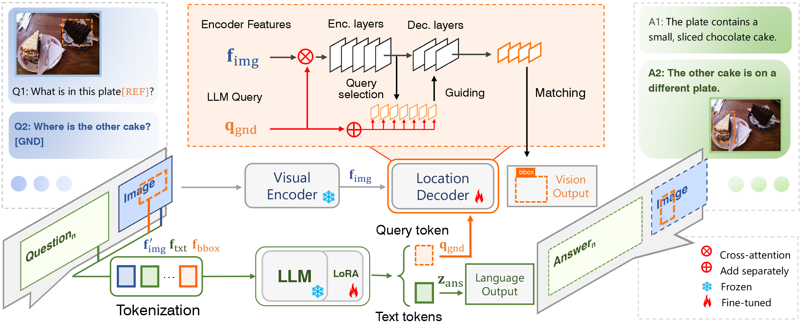

<div align="center">
<h1>ChatterBox </h1>

<h3> ChatterBox: Multimodal Referring and Grounding with Chain-of-Questions</h3>


</div>


## Abstract

In this study, we establish a benchmark and a baseline approach for Multimodal referring and grounding with Chain-of-Questions (MCQ), opening up a promising direction for logical multimodal dialogues. The newly collected dataset, named CB-300k, spans challenges including probing dialogues with spatial relationship among multiple objects, consistent reasoning, and complex question chains. The baseline approach, termed ChatterBox, involves a modularized design and a referent feedback mechanism to ensure logical coherence in continuous referring and grounding tasks. This design reduces the risk of referential confusion, simplifies the training process, and presents validity in retaining the language model's generation ability. Experiments show that ChatterBox demonstrates superiority in MCQ both quantitatively and qualitatively, paving a new path towards multimodal dialogue scenarios with logical interactions.


## Overview

<p align="center">
    </a> <br>
    The architecture of the ChatterBox model. 
</p>


## Contents

- [Install](#install)
- [Train](#train)
- [Evaluation](#evaluation)
- [Demo](#demo)

## Install

1. Clone this repository and navigate to ChatterBox folder

```bash
git clone https://github.com/sunsmarterjie/ChatterBox
cd ChatterBox
```

2. Install Packages

```Shell
conda create -n chatterbox python=3.11.5 
conda activate chatterbox
pip install --upgrade pip  # enable PEP 660 support
pip install -r requirements.txt
pip install deepspeed==0.11.1
unzip mmdet.zip
unzip mmcv-1.4.7.zip
cd mmcv-1.4.7/
MMCV_WITH_OPS=1 pip install -e .
cd ../model/GroundingDINO/ops
python setup.py build install
```


## Train

We build visual branch of ChatterBox using [GroundingDINO](https://github.com/IDEA-Research/GroundingDINO) and [DINO](https://github.com/IDEA-Research/DINO), we provide GroundDINO version now. 

* Prepare datasets/models:

Download [CB-300K](CB-300K), [VG](https://homes.cs.washington.edu/~ranjay/visualgenome/api.html), [COCO2017](https://cocodataset.org/#download), [COCO2014](https://cocodataset.org/#download), [RefCOCO](https://web.archive.org/web/20220413011718/https://bvisionweb1.cs.unc.edu/licheng/referit/data/refcoco.zip), [RefCOCO+](https://web.archive.org/web/20220413011656/https://bvisionweb1.cs.unc.edu/licheng/referit/data/refcoco+.zip), [RefCOCOg](https://web.archive.org/web/20220413012904/https://bvisionweb1.cs.unc.edu/licheng/referit/data/refcocog.zip), [Flickr30K](https://shannon.cs.illinois.edu/DenotationGraph/), [OpenSource](https://drive.google.com/file/d/1mHIm6u9D2SuUyGoQQI4bO7GC9ecjY_Y5/view?usp=sharing), [clip-vit-large-patch14](https://huggingface.co/openai/clip-vit-large-patch14), [
LLaVA-Instruct-150K](https://huggingface.co/datasets/liuhaotian/LLaVA-Instruct-150K/blob/main/llava_instruct_150k.json), [llava-llama-2-13b](https://huggingface.co/liuhaotian/llava-llama-2-13b-chat-lightning-preview/tree/main), [CB-materials](https://drive.google.com/drive/folders/1fskSZBmJ79uVd5aXAUJVmaZN4tvKM5Hd?usp=sharing), [groundingdino_swinb](https://github.com/IDEA-Research/GroundingDINO/releases/download/v0.1.0-alpha2/groundingdino_swinb_cogcoor.pth).

```
├── datasets
|   ├── CB-300K
|   |    ├── CB-MRG
|   |    ├── CB-LC
│   │    └── ...
|   ├── VG
|   |    ├── VG_100K
|   |    ├── VG_100K_2
│   │    └── ...
│   ├── MSCOCO2017
|   |    ├── train2017
│   │    └── ...
│   ├── MSCOCO2014
|   |    ├── train2014
│   │    └── ...
│   ├── Flickr30K
|   |    ├── flickr30k-images
│   │    └── ...
│   ├── llava_instruct_150k.json
|   ├── CB_materials
|            ├── CB-refcoco-GND
|            ├── CB-coco-GND
|            ├── CB-refcoco-REF
│            └── ...
│── clip-vit-large-patch14
|             ├── config.json
│             └── ...
│── llava-llama-2-13b-chat-lightning-preview
|                      ├── config.json
│                      └── ...
│── OpenSource
|        ├── finetune_refcoco_train.json
|        ├── finetune_refcoco+_train.json
│        └── ...
├── groundingdino_swinb_cogcoor.pth
```

* Train ChatterBox on 8xA800 GPUs (80GB).

```
python startup_stage1.py  # stage1
python startup_stage2.py  # stage2
```


## Evaluation

See details at [evaluation](evaluation/readme.md).


## Acknowledgment

This project is based on LLaVA ([paper](https://arxiv.org/abs/2304.08485), [code](https://github.com/haotian-liu/LLaVA)), LISA ([paper](https://arxiv.org/abs/2308.00692), [code](https://github.com/dvlab-research/LISA)), GPT4RoI ([paper](https://arxiv.org/abs/2307.03601), [code](https://github.com/jshilong/GPT4RoI)), thanks for their excellent works.
